This summer, I spent 99 days sleeping on the sidewalks of downtown Chicago.

I'll write more about this in my book,
but for now, here's an article about my experience.

### Why would anyone voluntarily do this?

A few reasons.

First, I have always loved the minimalism and complete trust in Divine Providence that Jesus had.
He walked through the desert without food or water.
When he got to a well, his friends went to go buy food, and he asked a woman for a drink of water.

Second, Jesus was homeless.
He slept in the garden of Gethsemane, on Mount Olivet.
This is mentioned in only three verses, spread far apart (Luke 21:37, John 8:1).
And Jesus hints at it (Matthew 8:20, Luke 9:58).
Am I better than Jesus?
Yet he was the cleanest and best dressed man in the whole area.
The entire Bible, from Adam and Eve until Revelation,
makes it clear that nothing on earth is our true home,
that we are only passing through this place until we complete our trial.
Heaven is our true home.

Third, I was inspired by two movies years ago.
One was Ignatius of Loyola (2016) in which the saint became a homeless pilgrim.
The other was Our God's Brother (1997) written by Pope John Paul II.
I wrote two articles ([thoughts](/blog/art-purpose-beauty-communication.html),
[survey](/blog/my-favorite-film.html)) about it already.
In the movie's third act, the saint joins the homeless in order to help the homeless.

<!-- Fourth, as a full time author, it gets quite lonely being by myself all the time.
After high school I moved and lost contact with all those friends.
After I got married to a very controlling woman, I lost the ability to make friends.
After my divorce I lost the friends I made during my marriage.
After I became Catholic, I lost all my family, which are all very anti-Catholic.
Being homeless would force me to be around people and find ways to make friends. -->

Pope Benedict XVI made the point somewhere that
it's not material help that can truly help people in poverty,
it's the love transferred to the person in poverty
when material help is given to them personally and from genuine love.
He argues that systemic support is therefore ineffective and inferior
in comparison to individuals giving individually to the needy out of love.
Sure, this can be organized and scaled,
as St. Mother Theresa and St. Vincent de Paul did,
but that's not the same as it becoming cold and systemic.

There is a fundamental Catholic belief
that any suffering you endure patiently for God,
you can use as currency to purchase sinners,
in other words, to pay the debt they owe God,
and obtain for them the grace to quit sin and love truth.
St. Monica prayed and sacrificied for years
for the grace of conversion for the great St. Augustine, which paid off in spades.
Saints used to fast and pray all night for the conversion of this or that individual.
St. Louis de Montfort recommends giving all your sufferings to the Blessed Virgin Mary
and simply letting her choose how to spend it.
This is what I did.
Being homeless for 99 days is just another form of suffering.

### How did I survive?

First, I was able to easily make money every weekend,
by holding a sign that said "Terrible Advice Only $3",
partly to innovate a way that homeless people could earn money,
and partly because I did not think begging would be dignified.

Some homeless people I met told me they were making
$50 a day on weekdays and $100 on weekends, at least.
I tried suggesting they do what I do to *earn* money,
but even if they were making less than me, they said no.

Getting a cheap gym membership allowed me to shower every day.
Thrift stores are cheap enough that I could buy new clothes each week.
And my briefcase allowed me to store extra socks and underwear,
while I was able to wash the old ones in the gym shower with travel Tide.
A laptop briefcase is able to store quite a lot more than a laptop.

I moved in the end of winter, beginning of spring,
when it was still cold enough that I had to buy a blanket.
Fortunately it was only $5 at a thrift store.
When that got stolen, another was still only $5.

The hardest part was stashing my briefcase and blanket
somewhere safe during the day and night,
so they wouldn't get stolen, and I could travel light.
Eventually I found a spot behind a construction wall.
Thieves are generally lazy and without imagination,
so just the slightest bit of creativity outsmarts them.
The only reason my blanket was stolen was because
I hung it up on a sidewalk scaffold to dry
when it got rained on one day.
I didn't make that mistake again.

For the first month, I slept in a little crevice,
between two unrelated construction spots.
After that, I slept under awnings when it rained,
or just on the open sidewalk right next to the street.

As for food, Jewel has hotdogs,
chicken sandwiches,
and 10-piece chicken nuggets,
for $1 each for lunch and dinner.
Extremely good deal, and very filling.

### What good things happened to me?

Several times, I would wake up to find food, water, or money next to me.

I met a few friends who, even after I told them I was homeless, still accepted me.

One man, who worked in IT,
stopped one morning on the way to work,
to have a conversation with me.
The whole time, he treated me like a normal person, which was unusual.

One young woman, on the way to work in the morning,
asked if she could pray over me.
So we held hands and she prayed a sincere prayer for me.
She also gave me $20.

More good things happened, but I'll save that for my book.

### What bad things happened to me?

Obviously it was humiliating to sleep outside on the sidewalk.
This was very emotionally painful for me.

A few people I knew, when they saw me being homeless,
were visibly uncomfortable, and it clearly ruined the relationship.
People have the belief that, if you're homeless,
you're either on drugs or have a mental illness.
In general they're right.
That's basically every other homeless person I saw except me.

One night when I was sleeping,
I woke up and found two water bottles next to me.
Apparently someone gave them to me, how nice of them.
I went back to sleep.
I woke up again, because a group of black teenage girls
were pouring those water bottles on me.

One night, a very drunk, very large man
told me to stop sleeping on the sidewalk,
and to go find a spot under a bridge.
He was clearly ready to get violent,
and he was just "breathing threats and murder",
like Saul on the road to Damascus.

I saw him again a few nights later.
He was across the street with his friend,
shouting insults at me.
So I literally stood up for myself.
He then crossed the street.
My attempt to deescalate it
by introducing myself and trying to shake his hand,
was useless.
He was too drunk and too angry.
He just kept walking into me
with his alcohol-sweat drenched shirt
pressing up against my clean button-up,
and his alcohol-saturated breath
distracting me from thinking of what to say or do.
Later, his friend came back and apologized to me,
and offered me his leftover food, which I declined.

One evening, I finished dinner at Panera on State St.
and noticed their bathroom was out of toiler paper.
It was slow, and two lazy employees were chatting.
I let them know about it and they did nothing.
An hour later I let them know again,
and as I walked away one told the other I was pissing her off.
An hour later, I let them know again, still nothing.
Finally, 20 minutes before closing, I asked if they could fix it.
They said no, they have none, a truck would be coming.
First thing in the morning, 6am sharp, as soon as they opened,
I went in and told one of the hard working employees,
and he immediately put some in their bathroom.
They had it all along.
Those two girls should be fired.
Better that they're fired, learn their lesson, and go to heaven,
than remain lazy liars, and go to hell forever.

One night, a very fat black woman in what looked like a police uniform,
but which I now know to be a security guard uniform,
who I believe worked at the SAIC residence on State St.,
came over when I was praying the Rosary and laying down,
and loudly told me to move.
She lied and told me it was illegal to be homeless (it's not).
She looked like a police officer so it tricked me into thinking she was.
She threatened to spray me with pepper spray if I didn't move.
She didn't listen to almost anything I said, and just kept shouting "MOVE."
She grabbed my blanket and walked 50 feet south and threw it on the ground.
I hope she gets fired, but more importantly, I hope she develops *any* compassion.
Heaven certainly doesn't let bullies and liars like her in.
I've been bullied my whole life, and I was disappointed that I gave in again.
So the next night, I slept in that same spot,
preparing myself to be pepper sprayed for standing up for myself,
but she didn't come over and tell me to move.

Eventually I had to buy Off! bug spray,
because waking up to mosquito bites was *extremely* unpleasant.
It mostly worked, but it was expensive.

More bad things happened, but I'll save that for my book.

### The end

Anyway, I moved back to my hometown.

I'm still recovering from the trauma
of being bullied and threatened,
and losing a few friends and acquaintances
and the respect of the general public.
So you won't see me as much,
as I'm taking a little time off,
to focus entirely on my book.

Part of why I'm writing my book
is to make enough money to pay off my few remaining debts.
Part of it is to share what I've learned with my children about life.
And part of it is to do my final philosophizing about life,
to finally put all these scattered thoughts into organized words.

Once the book is done,
if God still wants me on earth,
I will endure whatever suffering he wants,
and even be homeless if he wills it,
like St. Adam Chmielowski,
or St. Ignatius of Loyola,
or St. Benedict of Nursia,
or St. Francis of Assisi,
or countless others,
giving whatever suffering I endure
as currency to God to purchase souls.

Besides, I don't like this world,
it is unjust and corrupted.
Anything good about this life
will also be present in heaven.
So why not use this lifetime
to help populate heaven,
and wait to enjoy true life then,
but with more people?

<!-- 

This summer, I spent 100 days sleeping on the streets of Chicago, as an experiment.
Here are all the interesting things that happened.

## Motivation

I was very inspired by the movie Our God's Brother,
which I wrote an entire [article](/blog/art-purpose-beauty-communication.html) about.
This movie was originally written as a play by Pope John Paul II as a young priest,
and is based on a true story of a saint that inspired him to become a priest.

In it, the protagonist decides to help the homeless by becoming homeless,
and living entirely off God's providence through the charity of strangers.
Many homeless people join him in this new way of living, praying and asking for alms.

The homeless people were happier, not because they had more, for they were still poor and homeless.
But they were happier because they were receiving love, the love of God,
manifested through the loving actions of strangers.
And experiencing that love made them happy.

I first felt that a few years ago.
I was out of money, but not homeless.
So I went to Chicago on a cold winter day,
and sat down for a few hours,
holding out my hands, hoping for anything.

I was shivering because it was freezing.
One young woman put a blanket over me.
As she walked away, I saw her look back at me and smile.
The smile looked so full of love, genuine love,
that I wondered if she might be an angel in disguise.
I kept and used that blanket for many years.

## First day

The very first day, I was so excited.
I had this whole idea that I would spent a lot of my days
drawing charcoal drawings on the sidewalk and selling them.
I had recently gotten into drawing,
So I went to Blick and bought $50 worth of charcoal drawing material.

I got the idea from a David Bowie quote
that I could encourage people to draw art.
This was a day after a homeless man I know in my home town said to me,
"Why do you keep trying to draw? You're not good at it. You should just give up."
He said it with absolutely no malice. He 100% believed he was trying to help me.

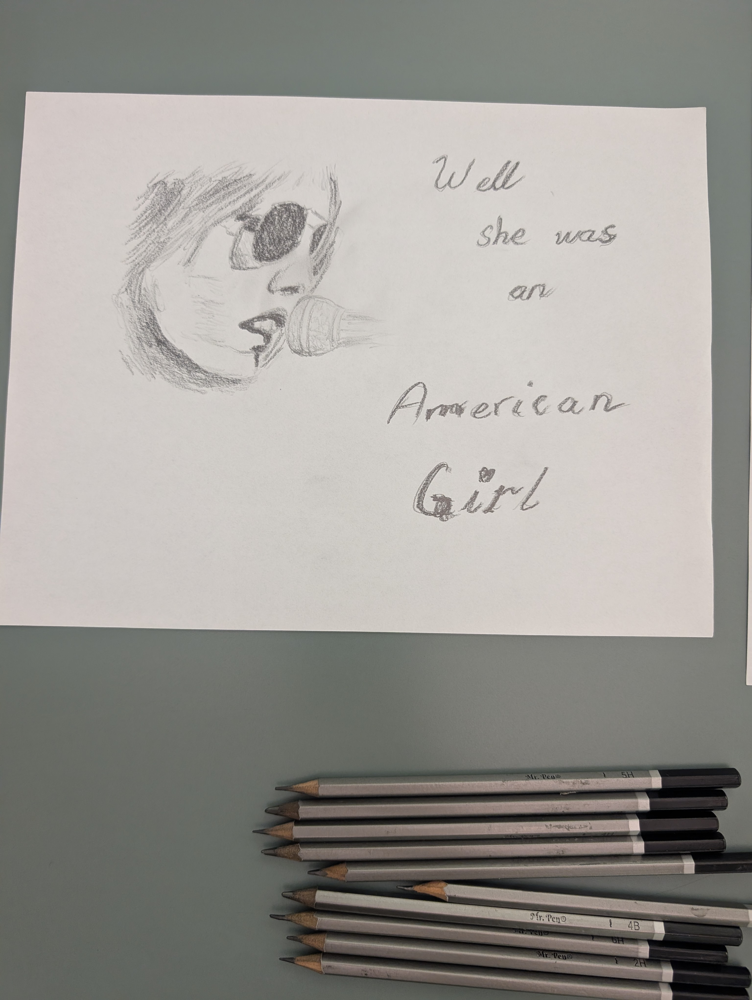
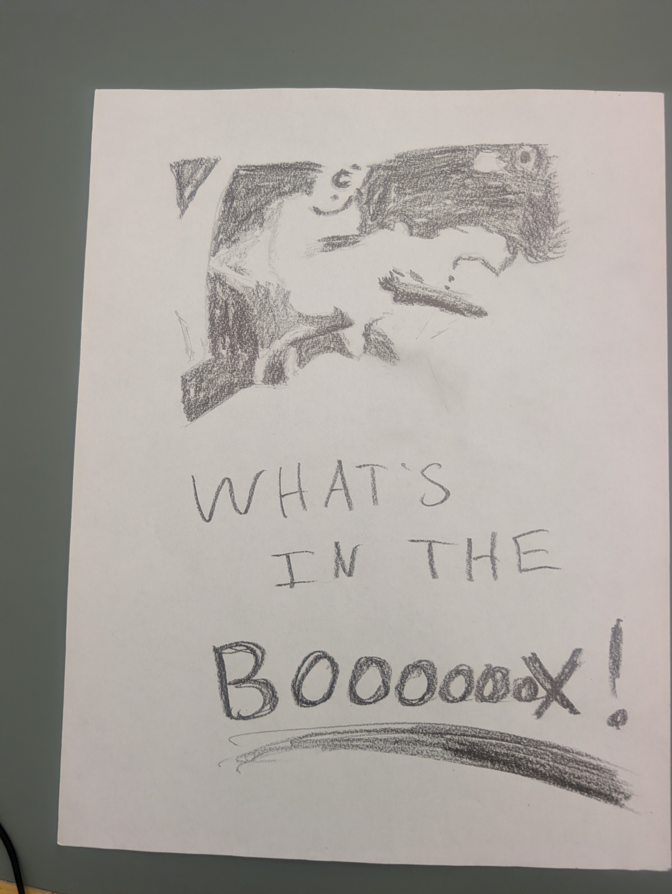
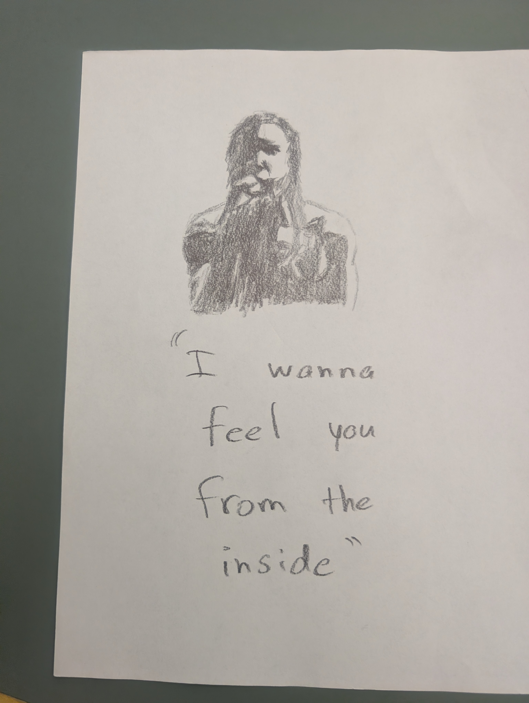
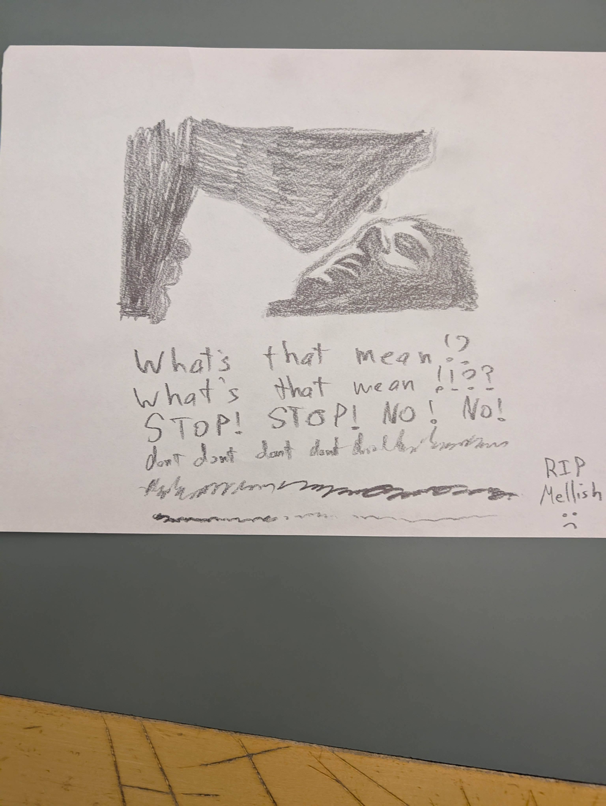
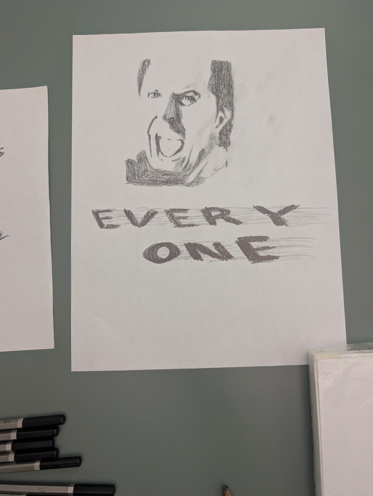
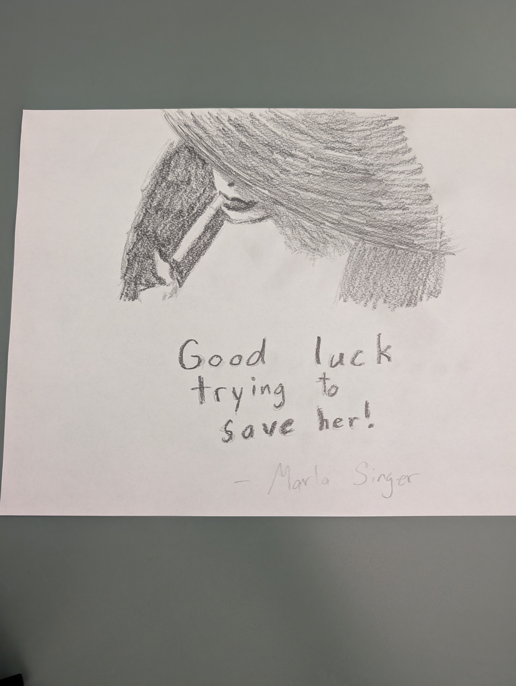
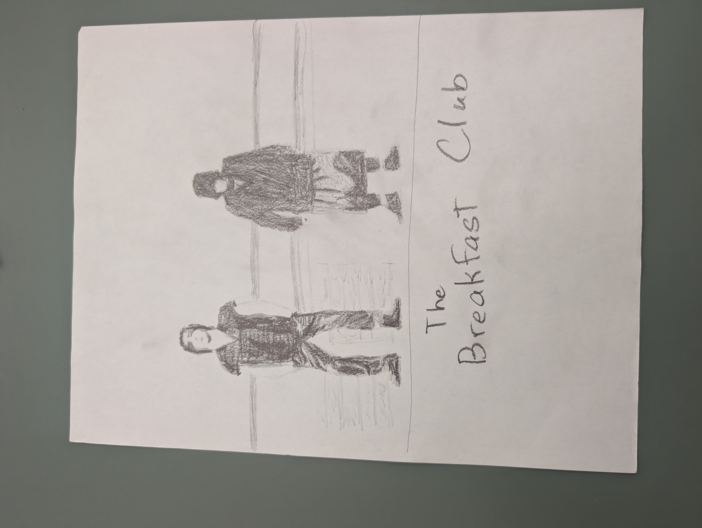

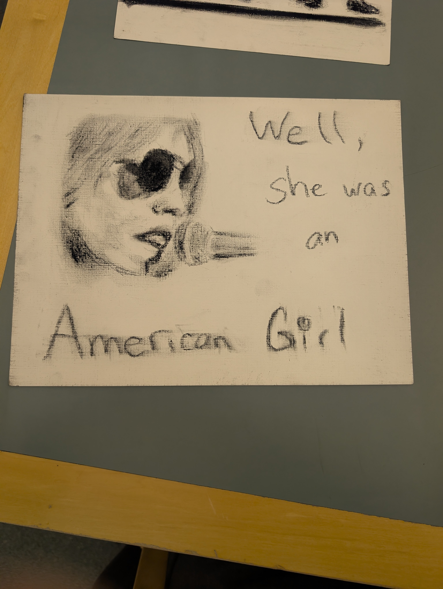
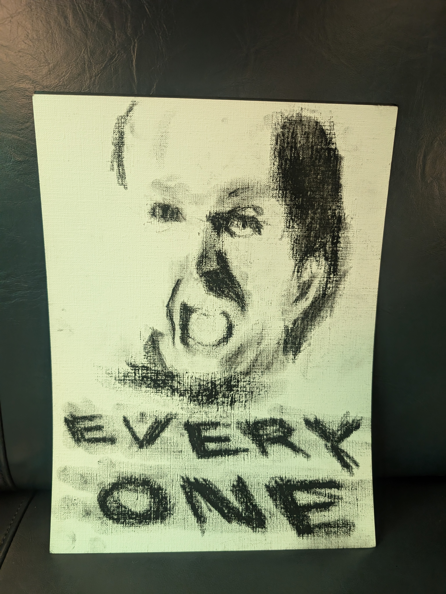
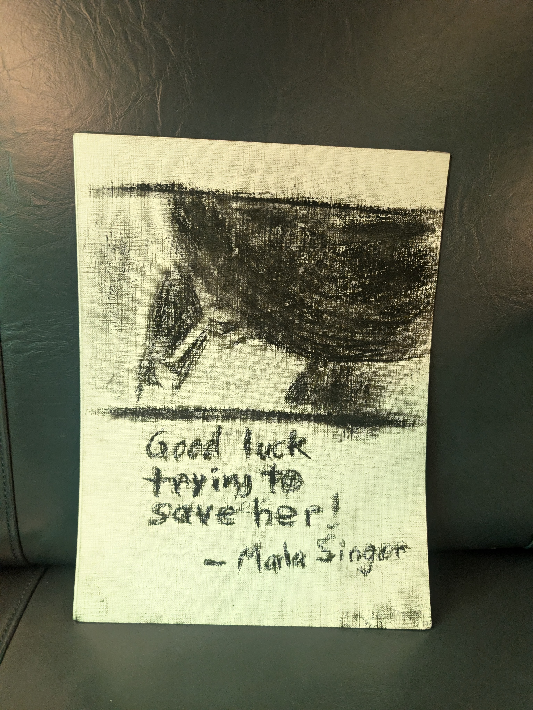
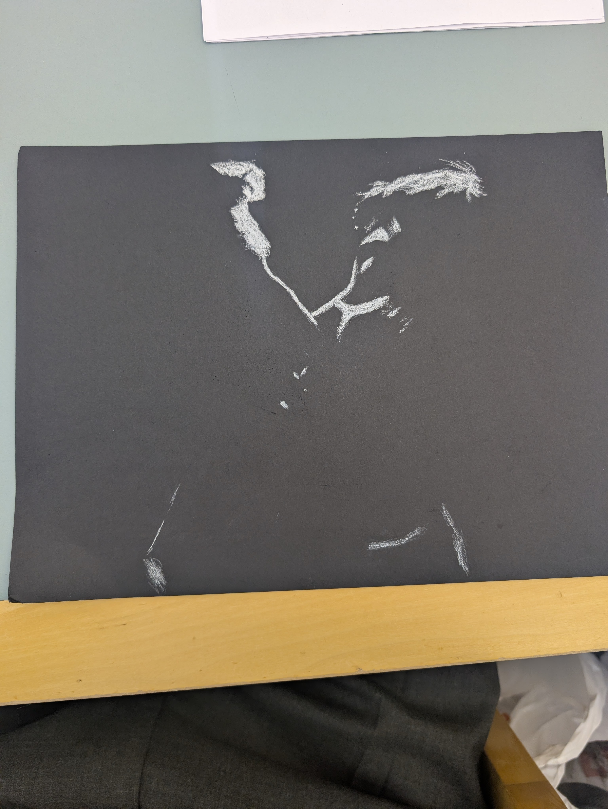
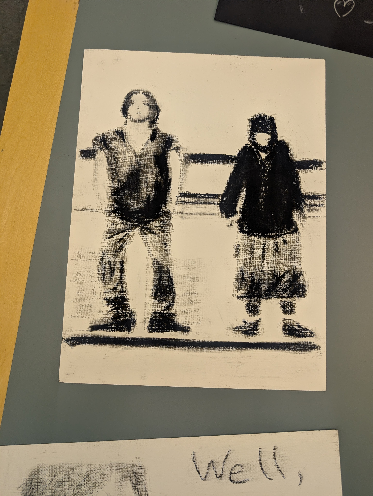

-->

