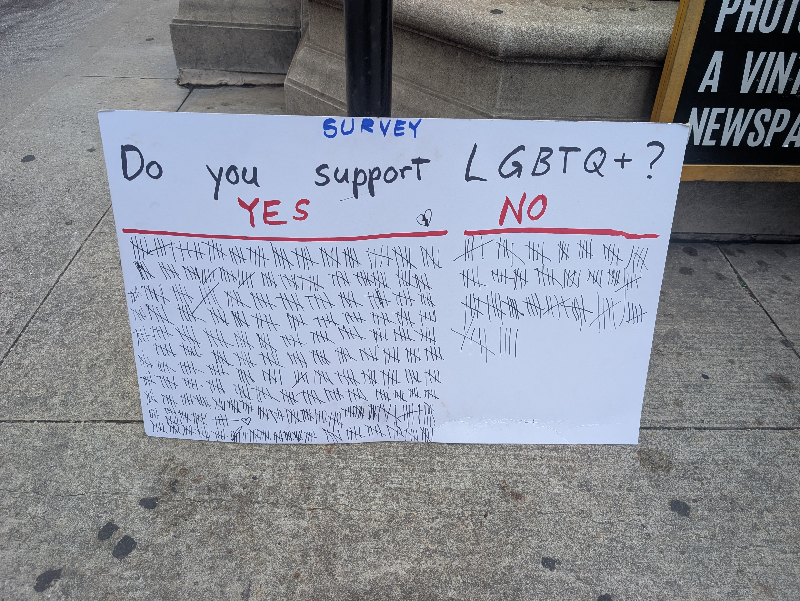

I did this survey in a *much* busier part of downtown
than my usual spot. Because of that, there are two sides,
front and back, and both became absolutely full.

For the first side, I let people draw their own tallies as usual.
But they were so sloppy, and so big, and we were getting so many more results,
that I realized that wouldn't work this time.
So on the back side, I did the tallies almost entirely myself,
making them small and orderly, so we'd have enough room.

But still, some people instinctively reached for the marker to tally it.
And when one person tallied it, everyone behind them
thought that's just how you do it, so I kind of had to let them.
But most people would either give a thumbs up or down,
or they would call out yes or no, and I'd mark it down.

There's clearly an imbalance here.
But I think a few things skew the results.

First, "No" is such an unpopular opinion, especially in a liberal city,
that many people probably felt ashamed to declare it publicly.
Especially if they were around friends/family/coworkers who disagreed,
or if they thought I might be recording them for social media.

Second, in a city like Chicago, people might not feel *safe* saying "No".
Although I've never really seen violence in my time in Chicago,
I do know people who refuse to even *eat* in the loop because of it,
so apparently there's a stigma or stereotype about the city,
that if you make the wrong move, you put yourself in danger.
And perhaps some people think saying "no" could be such a wrong move.

Third, it may feel like a losing battle, just looking at the results.
So they may think to themselves "what's the point in voting? we've already lost."
Just a guess, based on some of the sad faces I saw looking at the results.

A lot of people from cars and buses signalled or called out their answers,
which was very fun and different than I'm used to.
I kind of want to do another survey in that same spot for that reason.
It just feels so nice connecting with strangers in a fun new way like that.

A few people who said no, I think they were trolling,
just to add to the "No" category to ragebait others.
Because some of them seemed to be doing it
very tongue in cheek, holding back a laugh.

Anyway I'm writing this almost two months later,
so that's all I can remember.
